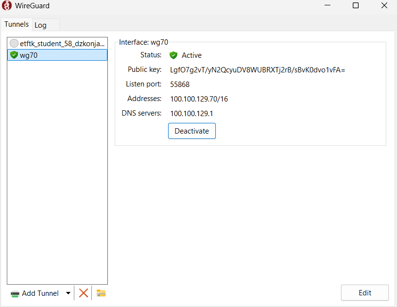

# Sistemi i servisi mobilnih telekomunikacija
# Projekat 2 : WireGuard VPN baziran na 5G podatkovnoj mreži 

Grupa : Vedad Crnčalo, Harun Dedović, Džejlana Konjalić, Amna Bumbul, Amila Čengić, Emrah Dragolj, Denin Mehanović

## Postavka projekta : 

• RP1: Dizajn WireGuard VPN-a baziranog na 5G podatkovnoj mreži, a koji uključuje različite scenarije:  
  (1) jedan WireGuard peer se nalazi unutar, a drugi izvan 5G mreže i  
  (2) oba WireGuard peer-a se nalaze unutar 5G mreže.

• RP2: Implementacija podatkovne usluge u 5G SA mreži korištenjem AMARI Callbox Classic rješenja i 5G modema.

• RP3: Implementacija VPN-a za scenarij (1).

• RP4: Implementacija VPN-a za scenarij (2).

• RP5: Eksperimentalna analiza signalizacijskih tokova za scenarije (1) i (2).

• RP6: Izrada projektne dokumentacije i održavanje GitHub repozitorija.

---

| Radni paket (RP) | Opis | Zaduženi članovi |
|:----------------:|:-----|:------------------|
| RP1 | Dizajn WireGuard VPN-a u 5G mreži | Vedad Crnčalo, Harun Dedović |
| RP2 | Implementacija podatkovne usluge (5G SA) | Harun Dedović, Denin Mehanović |
| RP3 | Implementacija VPN-a (scenarij 1) | Džejlana Konjalić, Amila Čengić, Amna Bumbul |
| RP4 | Implementacija VPN-a (scenarij 2) | Denin Mehanović, Emrah Dragolj, Amila Čengić |
| RP5 | Analiza signalizacijskih tokova | Emrah Dragolj, Amna Bumbul, Džejlana Konjalić |
| RP6 | Dokumentacija i GitHub repozitorij | Vedad Crnčalo |

---

# Uvod i cilj projekta

U ovom repozitoriju sadržaja je implementacija i analiza WireGuard VPN rješenja u okviru 5G standalone (SA) mreže, realizovane korištenjem AMARI Callbox Classic sistema i dva 5G modema.

Cilj projekta je dizajnirati, implementirati i eksperimentalno analizirati sigurnu VPN komunikaciju u dva različita 5G mrežna scenarija, sa fokusom na signalizacijske tokove, rutiranje saobraćaja i pouzdanost veze.

Projekt obuhvata dva glavna scenarija:
- komunikaciju između korisnika unutar i izvan 5G mreže,
- komunikaciju između korisnika koji se oba nalaze unutar 5G mreže.

Svi koraci konfiguracije, eksperimentalni rezultati i tehnička dokumentacija dostupni su unutar ovog GitHub repozitorija.

## Spomenuti pojmovi

### 5G Standalone (SA) arhitektura

5G Standalone (SA) arhitektura predstavlja implementaciju 5G mreže koja ne zavisi od postojeće LTE infrastrukture, već koristi namjenski 5G Core i 5G baznu stanicu (gNB). Ovakva arhitektura omogućava potpunu kontrolu nad signalizacijom i korisničkim podatkovnim saobraćajem, kao i podršku za naprednije 5G funkcionalnosti kao što su niske latencije i fleksibilnog upravljanja mrežnim resursima [^1]. U okviru ovog projekta 5G SA arhitektura predstavlja osnovu mrežnog okruženja u kojem se realizuje i analizira VPN komunikacija, omogućavajući praćenje signalizacijskih tokova i ponašanja podatkovnog saobraćaja.

### WireGuard VPN

WireGuard je siguran VPN protokol i open-source softver dizajniran sa ciljem jednostavne konfiguracije, visoke efikasnosti i minimalne kompleksnosti. Implementacija WireGuard-a zasniva se na savremenim kriptografskim algoritmima i koristi model identifikacije peer-ova putem kriptografskih ključeva, čime se eliminiše potreba za složenim mehanizmima upravljanja certifikatima i autentikacijom zasnovanom na korisničkim imenima i lozinkama [^2].
WireGuard funkcioniše na nivou mrežnog sloja i uspostavlja virtualne point-to-point interfejse preko kojih se ostvaruje enkriptovana komunikacija.

Primjena VPN mehanizama u 5G mrežama ima značajnu ulogu u obezbjeđivanju izolacije korisničkog saobraćaja, zaštite podataka i logičkog razdvajanja mrežnih tokova, što je detaljno razmatrano u radu [^3]. U navedenom kontekstu, VPN rješenja se koriste kao dodatni sigurnosni sloj iznad osnovne 5G mrežne infrastrukture. U okviru ovog projekta WireGuard se koristi kao mehanizam za uspostavljanje sigurnog tunela između krajnjih tačaka, čime se omogućava eksperimentalna analiza zaštićene komunikacije u 5G Standalone mrežnom okruženju.

### AMARI Callbox Classic

AMARI Callbox Classic je platforma namijenjena testiranju i mjerenju mobilnih mreža, koja omogućava emulaciju 5G bazne stanice (gNB) i 5G Core mrežnih funkcija u kontrolisanom okruženju. Sistem se široko koristi u istraživačkim i industrijskim okruženjima za analizu performansi, signalizacije i funkcionalnosti 5G mreža. U kontekstu ovog projekta AMARI Callbox Classic predstavlja centralni element 5G testne mreže, omogućavajući praktičnu realizaciju arhitekture sistema i eksperimentalnu evaluaciju WireGuard VPN komunikacije [^4].

---

# Arhitektura sistema
<p align="center">

<br>
<em>Slika 1: Scenarij 1 </em>
</p>

**Scenarij 1 :** Ovaj dijagram prikazuje komunikaciju između klijenta (UE1) i udaljenog servera (UE2). Klijent je povezan na 5G modem, koji dalje komunicira sa AMARI Callbox uređajem. AMARI Callbox uspostavlja siguran WireGuard tunel preko interneta prema serveru, omogućavajući pouzdanu i zaštićenu razmjenu podataka između krajnjih tačaka, bez obzira na javnu mrežnu infrastrukturu.

<p align="center">

<br>
<em>Slika 2: Scenarij 2 </em>
</p>

**Scenarij 2 :** Ovaj dijagram prikazuje dvosmjernu, sigurnu komunikaciju između klijenta (UE1) i servera (UE2), gdje su obje krajnje tačke povezane putem 5G modema. Svaka strana uspostavlja WireGuard tunel prema AMARI Callbox uređaju, koji djeluje kao centralna tačka za sigurno rutiranje saobraćaja. Na ovaj način je omogućena pouzdana i enkriptovana razmjena podataka između UE1 i UE2 preko mobilne mreže i interneta, uz izolaciju i zaštitu komunikacije.

---
# Konfiguracija rutera
Tokom vježbe uspostavljena je 5G SA mreža korištenjem AMARI Callbox Classic sistema i 5G modema. Najprije je ostvaren pristup 5G modemu kako bi se provjerila njegova IP adresa i osnovni status mrežne konekcije.

Nakon toga analizirani su konfiguracijski fajlovi bazne stanice (gNB) u AMARI okruženju. Posebna pažnja posvećena je postavkama vezanim za podatkovni saobraćaj, kao što su mrežni interfejsi, IP adresiranje i način uspostavljanja korisničke podatkovne sesije u 5G SA mreži.

Kroz web interfejs rutera provjerene su i LAN i WiFi postavke, uključujući aktivne mreže, DHCP opseg i status 5G NR-SA veze. Na taj način je potvrđeno da je korisnička oprema uspješno povezana na mrežu i da se podaci pravilno razmjenjuju.
<p align="center">

<br>
<em>Slika 3: Postavke rutera </em>
</p>

<p align="center">

<br>
<em>Slika 4: Postavke rutera </em>
</p>

## PLMN Managment
**PLMN Management :** omogućava upravljanje povezivanjem uređaja na mobilne mreže. Uređaj može automatski birati dostupnu mrežu ili omogućiti ručni odabir operatera.

  PLMN Auto Selection – automatski ili ručni izbor mreže

  Scan – pretraga dostupnih mobilnih mreža

  Available – mreža je dostupna za povezivanje

  Forbidden – mreža nije dozvoljena za trenutnu SIM karticu

  Type – tehnologija mreže (NR5G, LTE, UMTS)

  PLMN – jedinstveni identifikator mobilne mreže

Odabrana mreža se potvrđuje klikom na Apply, dok Cancel poništava izmjene.
<p align="center">

<br>
<em>Slika 5: Postavke rutera </em>
</p>

---
# Konfiguracija WireGuard tunela 
## WireGuard manual setup (wg70)

Ovaj dio pokazuje **ručno kreiranje WireGuard tunela** na Linuxu,
korak-po-korak, koristeći interfejs `wg70`.

> Napomena: Ovo je edukativni / testni setup.  
> Za produkciju se preporučuje `/etc/wireguard/wg70.conf`.

---

### 1. Instalacija WireGuard-a

```bash
sudo apt update
sudo apt install wireguard
```
### 2. Generisanje privatnog ključa (ili ključeva)
```bash
wg genkey > private
chmod 600 private
```
Generiše se privatni ključ koji identifikuje WireGuard interfejs.
Permisije se ograničavaju radi sigurnosti.

### 3. Kreiranje WireGuard interfejsa
```bash
sudo ip link add wg70 type wireguard
```
Kreira se virtualni mrežni interfejs tipa WireGuard sa imenom wg70.

### 4. Dodjela IP adrese interfejsu
```bash
sudo ip addr add 100.100.129.70/16 dev wg70
```
Dodjeljuje se interna VPN IP adresa interfejsu, ova adresa se koristi unutar WireGuard mreže.

### 5. Postavljanje privatnog ključa na interfejs
```bash
sudo wg set wg70 private-key ./private
```
WireGuard interfejs dobija privatni ključ koji se koristi za autentikaciju i kriptografiju.

### 6. Podizanje (aktivacija) interfejsa
```bash
sudo ip link set wg70 up
```
Interfejs se aktivira i postaje spreman za komunikaciju.

### 7. Provjera WireGuard statusa
```bash
sudo wg
interface: wg70
  public key: LgfO7g2vT/yN2QcyuDV8WUBRXTj2rB/sBvK0dvo1vFA=
  private key: (hidden)
  listening port: 58713
```
Prikazuje informacije o WireGuard interfejsu, uključujući public key i listening port.

<p align="center">

<br>
<em>Slika 6: WireGuard tunel  </em>
</p>

<p align="center">

<br>
<em>Slika 7: WireGuard .conf fajl  </em>
</p>

Ova slika prikazuje aktivni WireGuard klijentski tunel koji je uspješno importovan iz konfiguracionog *.conf* fajla i pokrenut na Windows uređaju, naziv interfejsa odgovara imenu konfiguracionog fajla, dok su VPN IP adresa i DNS server definisani unutar *[Interface-a]* tog fajla.
Prikazani public key predstavlja jedinstveni identitet klijenta i mora biti dodat na WireGuard server kao odgovarajući peer kako bi komunikacija bila omogućena.
Jednom kreiran, ovaj *.conf* fajl može se sigurno distribuirati i koristiti na drugim uređajima i operativnim sistemima (Windows, Linux, macOS, mobilni), bez dodatnih izmjena.

<p align="center">

<br>
<em>Slika 8: ICMP provjera  </em>
</p>

Pinganje služi za provjeru da li je tunel aktivan i da li postoji mrežna povezanost između dva kraja. Slanjem ping paketa na IP adresu tunela provjerava se da li druga strana odgovara, što znači da je tunel ispravno uspostavljen. Ako se dobije odgovor (reply), tunel radi; ako nema odgovora, postoji problem u konfiguraciji ili mrežnoj vezi.

---

# Implementacija WireGuard VPN-a u 5G SA mreži

WireGuard VPN u ovom projektu koristi se kao dodatni sigurnosni sloj iznad 5G Standalone (SA) mrežne infrastrukture. VPN je implementiran na nivou korisničkog podatkovnog saobraćaja (user plane) i ne utiče na osnovne 5G signalizacijske procedure (registracija, autentikacija i uspostava PDU sesije).

Nakon uspješne registracije korisničke opreme (UE) u 5G SA mrežu i dodjele IP adrese od strane 5G Core mreže, WireGuard se pokreće kao virtuelni mrežni interfejs na krajnjem uređaju. Sav saobraćaj definisan pravilima rutiranja prolazi kroz enkriptovani VPN tunel, dok 5G mreža služi kao transportna infrastruktura.

---

## Logički princip rada WireGuard-a

WireGuard funkcioniše kao virtuelni point-to-point interfejs koji koristi statički definisane kriptografske ključeve za identifikaciju peer-ova. Nakon inicijalnog kriptografskog handshaka, podaci se enkriptuju i enkapsuliraju u UDP pakete koji se prenose preko 5G mreže i interneta.

Sa stanovišta 5G mreže, WireGuard saobraćaj se vidi kao standardni UDP/IP tok, dok su stvarni korisnički podaci zaštićeni end-to-end enkripcijom između krajnjih tačaka.

---

## Scenarij 1: UE unutar 5G mreže ↔ UE izvan 5G mreže

U prvom scenariju jedan WireGuard peer nalazi se unutar 5G SA mreže (UE1), dok se drugi peer (UE2) nalazi izvan 5G mreže i posjeduje javno dostupnu IP adresu.

**Tok implementacije:**

- UE1 se povezuje na 5G SA mrežu putem 5G modema i dobija IP adresu iz 5G Core mreže
- Na UE1 se kreira WireGuard interfejs sa internom VPN IP adresom
- UE2 djeluje kao udaljeni uređaj koji je povezan na Wi-Fi mrežu fakulteta
- UE1 inicira WireGuard konekciju prema UE2 koristeći njegov javni ključ i endpoint adresu
- Nakon uspješnog handshaka uspostavlja se siguran VPN tunel

Ovim pristupom omogućena je sigurna i pouzdana komunikacija između korisnika unutar 5G mreže i udaljenog sistema izvan nje, pri čemu 5G mreža ima ulogu pristupne mreže.

---

## Scenarij 2: UE unutar 5G mreže ↔ UE unutar 5G mreže

U drugom scenariju oba WireGuard peer-a (UE1 i UE2) nalaze se unutar iste 5G SA mreže, ali se njihova komunikacija dodatno štiti korištenjem VPN tunela.

**Tok implementacije:**

- Oba UE uređaja uspostavljaju sopstvene 5G podatkovne sesije
- Svaki UE ima zaseban WireGuard interfejs i internu VPN IP adresu
- WireGuard tunel se koristi za logičko povezivanje UE uređaja, nezavisno od njihove fizičke lokacije u mreži
- Sav međusobni saobraćaj prolazi kroz enkriptovani VPN tunel

Ovakav scenario omogućava analizu VPN saobraćaja unutar 5G mreže i poređenje ponašanja mreže sa i bez aktivnog VPN-a.

---
## Literatura

[^1]: https://ieeexplore.ieee.org/abstract/document/9289900

[^2]: https://www.wireguard.com/

[^3]: https://ieeexplore.ieee.org/abstract/document/10439170

[^4]: https://www.amarisoft.com/test-and-measurement/device-testing/device-products/amari-callbox-classic


